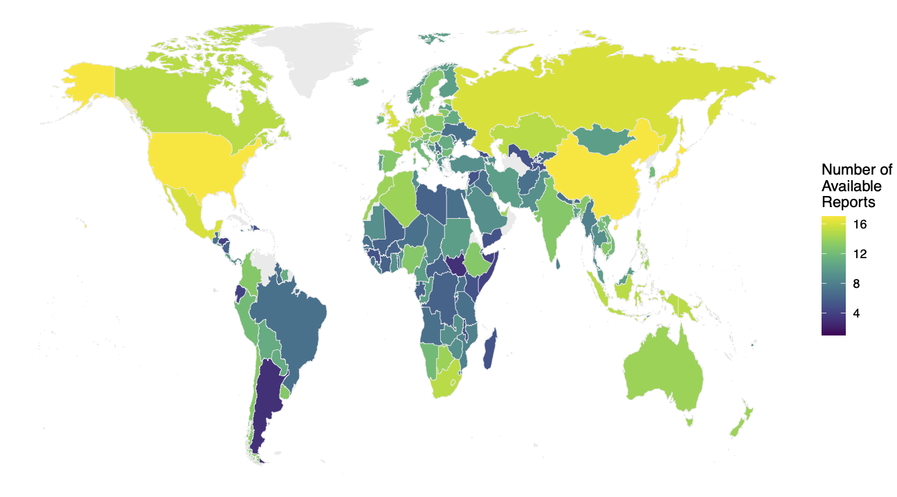

Can international organizations improve natural resource governance? The International Monetary Fund (IMF) is most noted for its role in crisis lending, where it can wield the "teeth" of loan suspensions to push for reforms. But IMF officials also spend a large amount of time conducting routine surveillance through Article IV consultations, which assess a country's economic developments and provide non-binding recommendations. Do governments follow this "toothless" advice?  We argue yes, though countries are more likely to take up the IMF's advice when they rely on external finance and when they wish to remain in the IMF's good graces. In an analysis of all Article IV consultations published between 2004 and 2019, we find that when Article IV reports place more emphasis on natural resource governance, resource-rich developing countries are more likely to adopt legislation to reform the oil, gas, and mining sectors. Our results suggest that technocratic consultation can lead to the adoption of policies that ameliorate the resource curse.

*Number of publicly available Article IV consultation reports, 2004--2019*