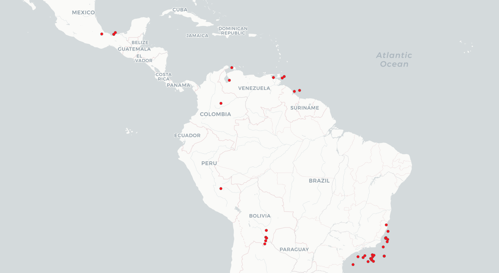

Over the last several decades, the political economy scholarship has debated the extent of the natural resource curse in developing countries. Conventional wisdom suggests that an abundance of natural resources, such as oil and natural gas, yields developmental stagnation. However, recent empirical studies have found mixed results, showing that natural resources can at times be a blessing, conditional on local economic development. We offer new insights into this debate by incorporating the role of financial investors in intensifying natural resource market volatility. We argue that financial investors rely on global commodity prices as cognitive short-cuts to evaluate the likelihood of sovereign debt repayment, leading to greater risk-acceptance and lower financing rates for
national governments during global commodity upturns. Exploiting information asymmetries between financial investors and local commodity suppliers, however, sovereign governments often condition their debt issuance on local production rather than global commodity prices.

In an econometric test of 18 Latin American countries between 1998 and 2016, we show this divergent behavior of creditors and debtors. In a region known for its resource dependence, we find that financial investors’ use of commodity price heuristics can skew market sentiment and spark investor exuberance, while national governments are surprisingly prudent, often limiting new borrowing to periods of new commodity discoveries or heightened production capacity. We illustrate our findings with two comparative case studies: the most representative case, Bolivia (a relative newcomer in sovereign debt markets which limited its debt issuance), and the deviant case, Venezuela (which leveraged investor optimism to fuel a debt issuance spree in the prelude to the commodity downturn). These findings have important implications for the study of globalization and development, demonstrating that financial markets – not sovereign governments – may lay the foundations of the resource curse by breeding over-optimism through easy credit.

*Oil and gas fields discovered in Latin America, 1996-2018*