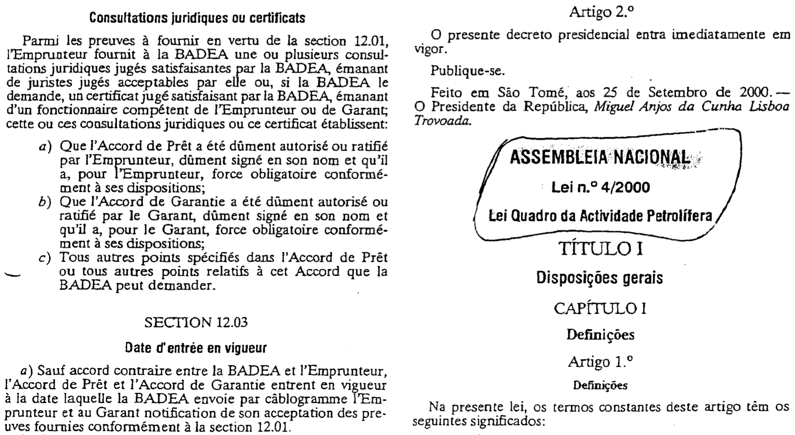

Can IMF lending improve natural resource governance in borrowing countries? While most IMF agreements mandate policy reforms in exchange for financial support, compliance with these reforms is mixed at best. The natural resource sector should be no exception. After all, resource windfalls enable short-term increases in discretionary spending, and office-seeking politicians are often unwilling to forgo this discretion by reforming the oil, gas, or mining sector. I investigate how and when borrowers go against their political interests and establish natural resource funds -- a tool often promoted by the IMF -- in the wake of a loan agreement. Using text analysis, statistical models, and qualitative evidence from natural resource policy and IMF conditionality for 74 countries between 1980 and 2019, I show that governments under an IMF agreement are more likely to create or regulate a resource fund, particularly if the agreement includes conditions that highlight the salience of fiscal reforms. However, the effectiveness of these conditions is highly dependent on context: reforms are more likely when the IMF can credibly threaten to suspend loan payments. This study contributes to extant research not only by introducing a novel dataset on country-level natural resource policy, but also, more broadly, by identifying under what circumstances international reform efforts can lead to changes in domestic legislation.

*São Tomé and Príncipe’s 2000 Oil Law*