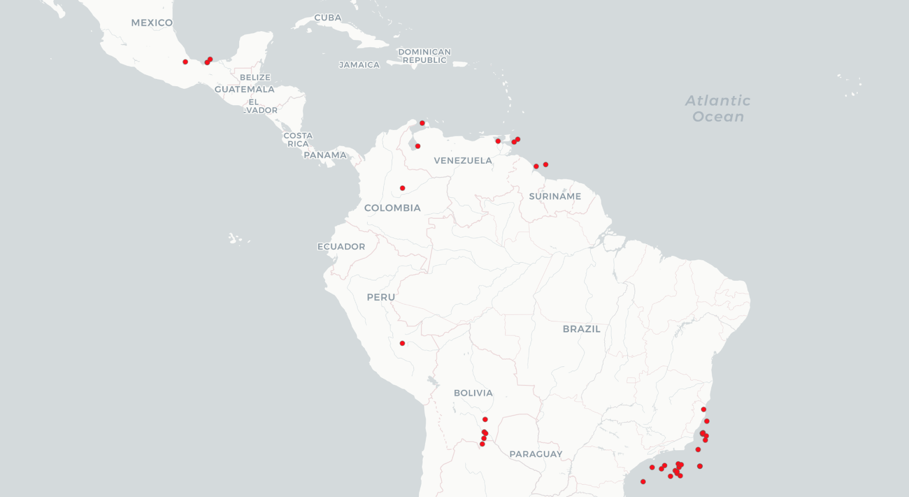

Natural resources like oil, natural gas, and minerals are often associated with a pattern of over-optimism among economic actors. In the wake of a sizable new oil discovery, for example, governments, markets, and international organizations tend to exuberantly estimate future economic rents and growth forecasts. We argue that natural resources increase investor expectations about a country’s ability to repay its sovereign debt. When information for evaluating a country’s sovereign risk is limited, natural resource wealth serves as a heuristic device: it increases the perceived creditworthiness of a sovereign borrower, even if it does not change a nation’s economic fundamentals in the short run. We provide evidence that resource-rich countries in the developing world receive easier access to credit from global financial markets: they can borrow at lower interest rates than their resource-poor counterparts, particularly during a cyclical upturn in commodity prices. We use the insights derived from our quantitative analysis to interpret the financial market implications of recent commodity boom and busts in Latin America, a region known for its resource dependence.

*Oil and gas fields discovered in Latin America, 1996-2018*