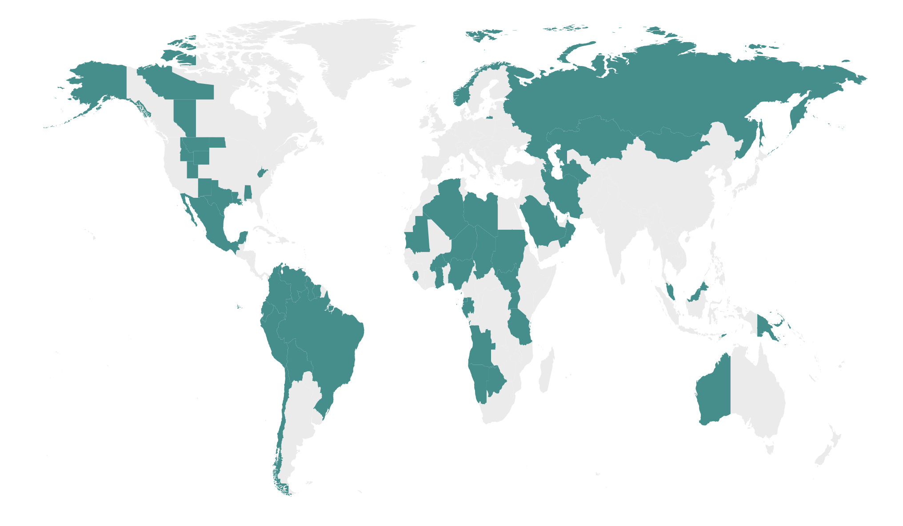

While some governments use resource rents for immediate political gain, others create transparent institutions that use natural resource revenue to promote sustainable long-term development. What explains this variation in natural resource policy? I argue that these differences are a function of political competition. Using novel data on natural resource legislation in 87 countries between 1975 and 2018, I show that incumbents are more likely to pass laws restricting their own discretion over natural resource revenue when they have high public approval and moderate levels of political competition. When rulers are safe in their seats, they can afford to adopt long-run developmental strategies, rather than using public funds for short-term political survival. Still, rulers must face some political competition: there must be a credible opposition citizens can turn to if the incumbent produces bad policy. This middling range of competition provides enough space to implement long-term policy while generating enough incentives to do so. These findings, complemented by an in-depth analysis of presidential systems in Latin America, suggest that a balance between job security and electoral risk is beneficial in motivating resource-rich governments to adopt policies that -- at least on paper -- are more efficient in the long run.

*Legal documents regulating the natural resource sector at the national level, 1975-2018*